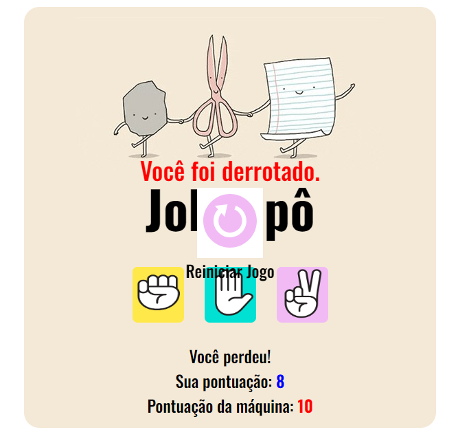

<h1>Jo-Ken-Po</h1>

<h2>Jogo de pedra, papel e tesoura criado com as tecnologias HTML, CSS e JavaScript</h2>

<b>Descrição:</b>

Desenvolvido no módulo de javaScript, este projeto foi muito gratificante, pois reforçou meu aprendizado, como funcionam as funções, interação com cada elemento HTML, e estimulou minha criatividade. Foi inspirado no jogo Pedra, papel e tesoura, onde o usuário enfrenta a máquina e, ao atingir 10 pontos, aparece uma tela indicando que venceu e o botão de reiniciar partida. Caso a máquina atinja os 10 pontos, aparece indicando que o usuário foi derrotado. Venha se divertir!!! 🪨 📰 ✂️

<b>Demonstração de como ficou:</b>

    
    
    

O que foi feito ✅:
- [x] - Arquivo HTML
- [x] - Estilização com CSS
- [x] - Utilização de JavaScript para interação com os elementos

O que falta fazer ⚙️:
- [ ] - Adicionar ranking de pontuação, aparecendo o nome do usuário ao lado com a posição e a pontuação atualizada
- [ ] - Transformar em aplicação para celular

<b>Tecnologias utilizadas 💻:<b/>

  
  
  

<b>Desenvolvido por:</b>

<table>
  <tr>
    <td align="center">
      <a href="https://github.com/gGtEriKk">
         
          
            <b>Erik Gomes</b>
          
      </a>
</table>
